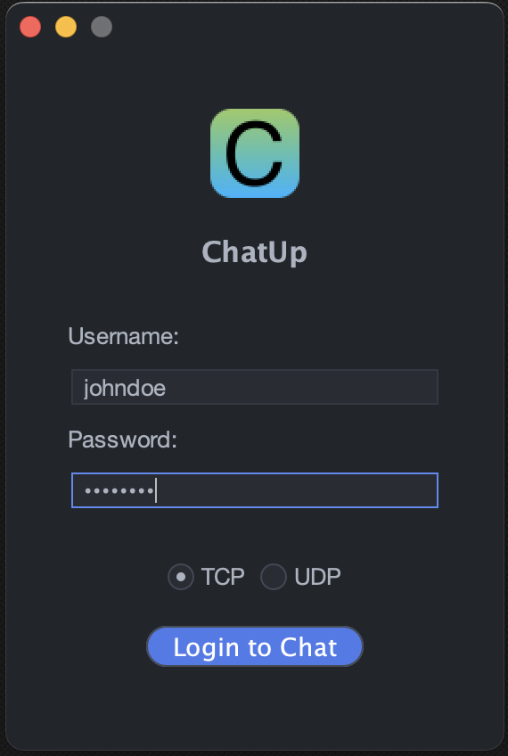
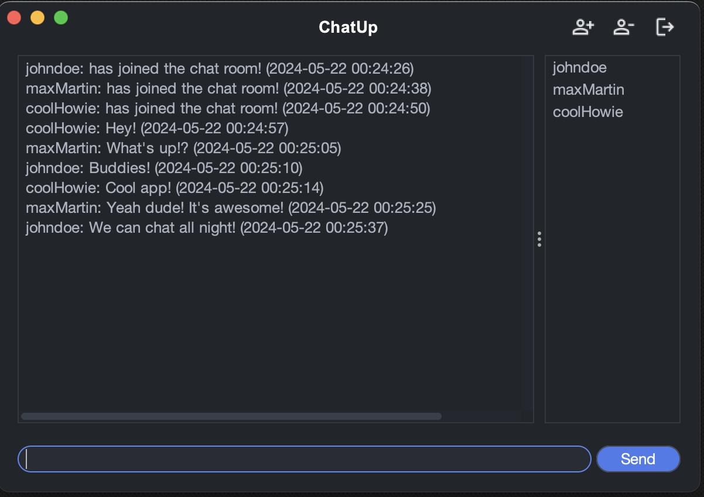

# Java MacOS Chat App

## Description
This MacOS application is a simple chat platform that utilizes Java Swing for its user interface. It offers users the choice between UDP Multicast or TCP connections for messaging. This app is designed to provide a seamless and responsive chat experience on MacOS devices.

## Features
- **Simple User Interface:** Built with Java Swing for a clean and intuitive user experience.
- **Flexible Connection Options:** Supports both UDP Multicast and TCP connections to suit different networking requirements.
- **MacOS Integration:** Optimized for performance and look on MacOS.

## Login UI


## Chat UI


## Installation
To run this application, follow these steps:

1. **Clone the repository:**
   ```bash
   git clone https://github.com/simonthorell/java-osx-chat.git
   ```
2. **Navigate to the project directory:**
   ```bash
    cd java-osx-chat
    ```
3. **Run the application:**
4. **Open the project in your preferred Java IDE and run the `ChatApp.java` file.**
5. **Start chatting!**

## Usage
Once the application is running:
1. **Select your connection type:** Choose between UDP Multicast or TCP connections.
2. **Enter your username:** Type in your desired username.
3. **Start chatting:** Begin sending messages to other users on the same network.
4. **Enjoy!**

## Contributing
Contributions are welcome! Feel free to open an issue or submit a pull request if you have any suggestions, bug reports, or feature requests.

## License
Distributed under the MIT License. See LICENSE for more information.